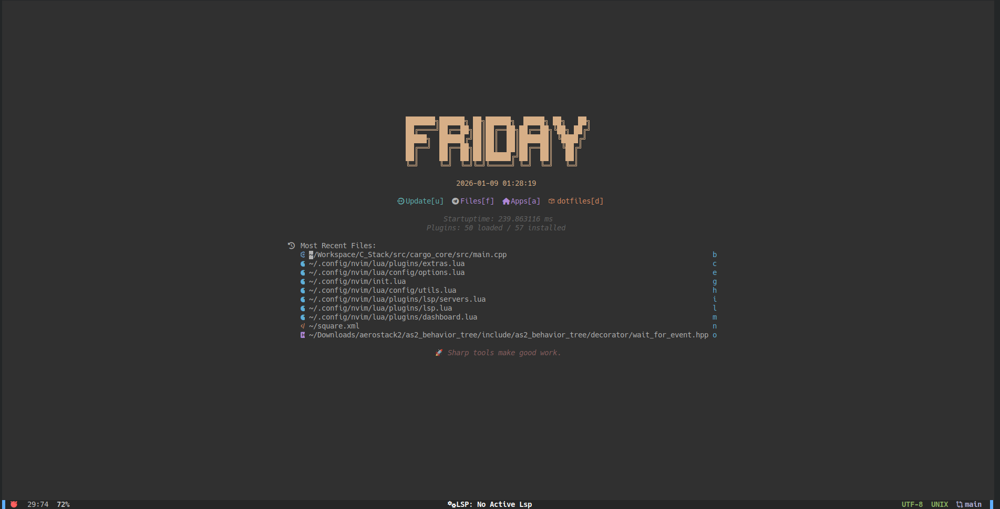
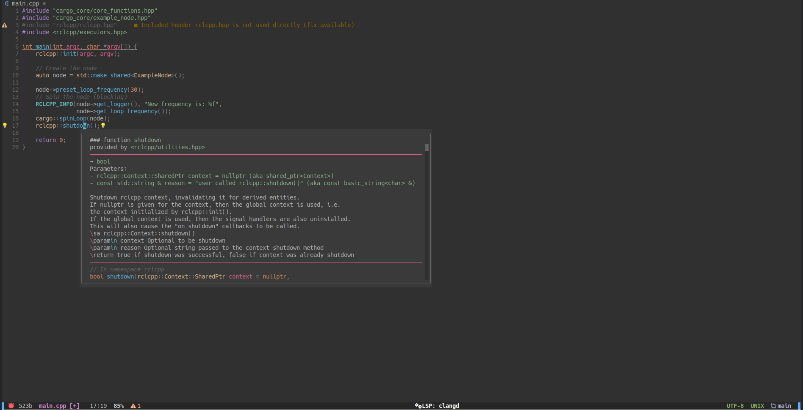
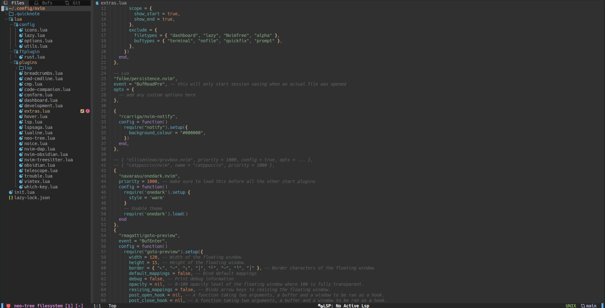
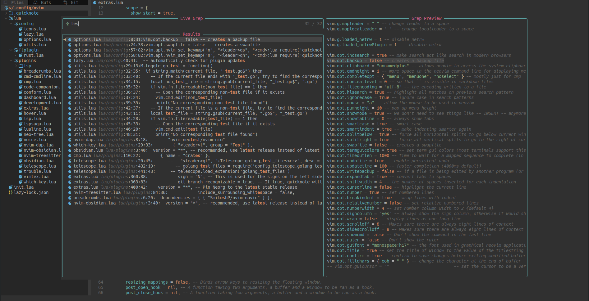

# Neovim Configuration

> A fast, lightweight-ish Neovim setup that is  
> **messy** and **bloated** (but still fast).

---

## ✨ Overview

This is my personal Neovim configuration.  

Some important notes before you dive in:

- 🧹 **Messy codebase** — refactors are… ongoing
- 🧪 **Bloated** — many plugins are installed for testing and forgotten
- 🪶 Still **very light in practice**

If you’re looking for a perfectly clean config — this is **not** it.  
If you’re okay with chaos that works — welcome.

---

## 📸 Screenshots

> UI, colorscheme, and plugins may change frequently.

<p align="center">
  <br/>
  <em>Dashboard</em>
</p>

<p align="center">
  
  <br/>
  <em>Editing (Lua & C++)</em>
</p>

<p align="center">
  <br/>
  <em>Telescope</em>
</p>


---

## 📂 Installation

Clone into your Neovim config directory:

```sh
git clone https://github.com/Flame25/Neovim_Setup.git ~/.config/nvim
```
